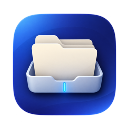
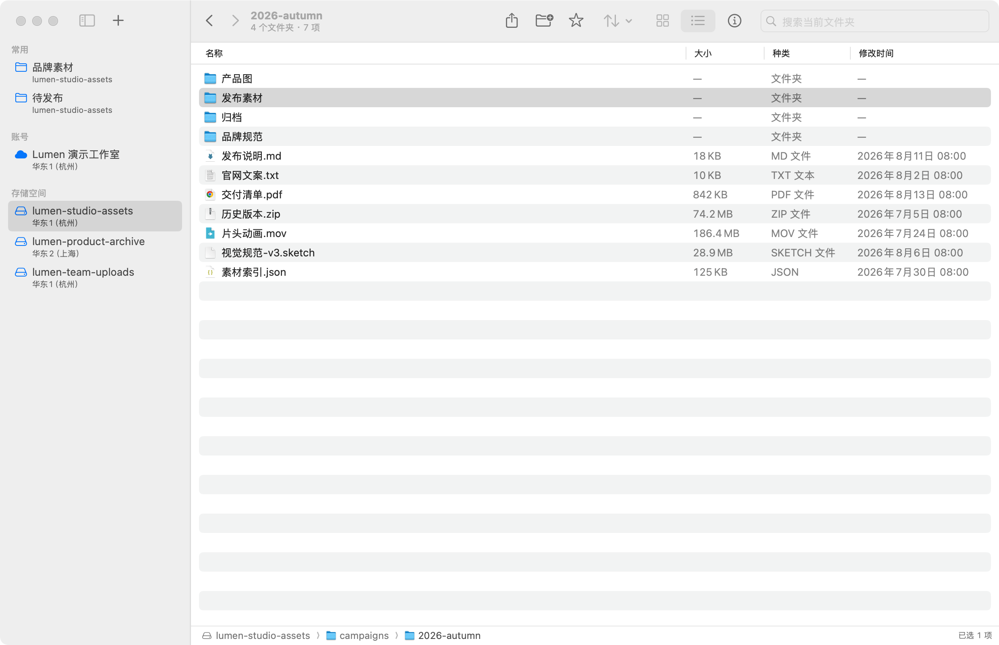
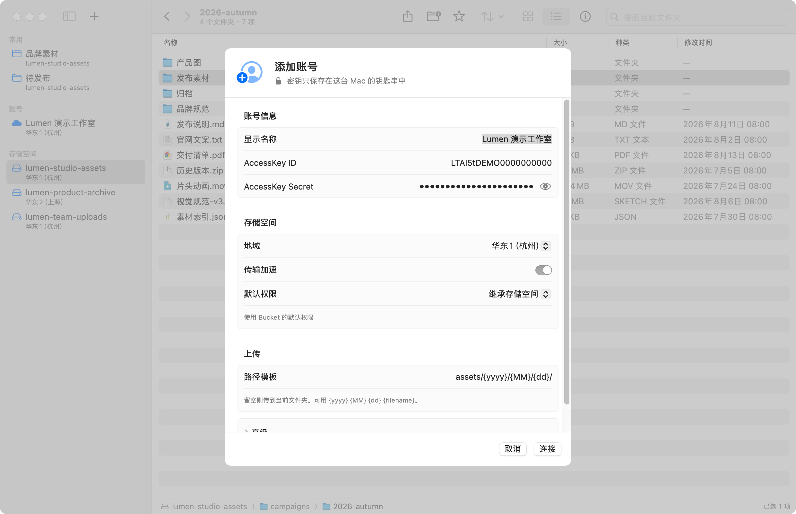

<p align="center">
  
</p>

<h1 align="center">Lumen</h1>

<p align="center">
  一款为 Mac 打造的阿里云 OSS 客户端。<br>
  用访达熟悉的方式浏览、整理、上传和分享对象。
</p>

<p align="center">
  <a href="https://github.com/ihopefulChina/Lumen/releases/latest/download/Lumen-0.0.4.dmg"><strong>下载 Lumen 0.0.4</strong></a>
  &nbsp;·&nbsp;
  <a href="https://github.com/ihopefulChina/Lumen/releases">版本记录</a>
  &nbsp;·&nbsp;
  <a href="https://github.com/ihopefulChina/Lumen/issues">问题反馈</a>
</p>

<p align="center">
  macOS 15+ · Apple Silicon
</p>

<p align="center">
  
</p>

## OSS，也可以像访达一样自然

Lumen 把账号、Bucket、文件和对象信息放进一个原生 macOS 窗口。单击选择、双击打开，使用 `⌘` 或 `⇧` 多选；网格、列表、路径栏、侧边栏收藏、快速查看和拖放整理都遵循熟悉的 Mac 操作。

### 找到内容

- 在网格和列表之间切换，按名称、日期、大小或类型排序。
- 收藏经常访问的 OSS 文件夹，从侧边栏一步抵达。
- 使用方向键移动选择，按空格快速查看，打开检查器查看对象信息。
- 切换账号、Bucket 或路径时，过期的网络响应不会覆盖当前页面。

### 整理内容

- 在同一 Bucket 内复制、移动或拖放文件与文件夹。
- 重命名文件夹时保留完整子目录结构。
- 所有目标会先做冲突检查；Lumen 不会静默覆盖已有对象。
- 云端移动会在复制全部成功后才删除源对象，失败时尽量回滚新建目标。

### 上传、下载与分享

- 拖入文件或整个文件夹，保留原目录结构；大文件自动分片上传。
- 从文件选择器、剪贴板或 Dock 图标接收素材。
- 批量下载文件和完整文件夹，失败任务可沿原路径重试。
- 复制原始链接、Markdown、HTML，或为私有对象生成临时签名 URL。
- 使用 OSS 图片处理加载缩略图，减少不必要的原图下载。

### 默认把安全放在前面

- AccessKey Secret 和 STS Token 保存在 macOS 钥匙串，不写入项目文件或偏好设置。
- 上传与下载会核对 OSS 返回的 CRC64；下载通过校验后才写入最终位置。
- 不完整的目录列表会阻止整文件夹移动、复制、下载或删除。
- 软件更新使用 Ed25519 签名，并在解压前验证安装包。

## 开始使用

1. [下载 Lumen 0.0.4](https://github.com/ihopefulChina/Lumen/releases/latest/download/Lumen-0.0.4.dmg)。
2. 打开 DMG，把 Lumen 拖到「应用程序」。
3. 添加阿里云 OSS 账号，选择地域，然后双击进入 Bucket。
4. 把文件拖进窗口，或按 `⌘O` 开始上传。

<p align="center">
  
</p>

账号还可配置 STS Token、传输加速、自定义 Endpoint、CDN 域名、默认 ACL 和上传路径模板。路径模板只在 Bucket 根目录生效，例如：

```text
assets/{yyyy}/{MM}/{dd}/
```

支持 `{yyyy}`、`{MM}`、`{dd}`、`{HH}`、`{mm}`、`{ss}`、`{name}`、`{ext}` 和 `{filename}`。

默认开启「只显示和上传素材」，支持常见图片格式及 GIF、WebP、SVG；关闭后也可浏览和上传其他文件。

## 自动更新

在菜单栏选择「Lumen → 检查更新…」，或在「设置 → 通用」开启自动检查。发现新版本后，Lumen 会下载并验证更新，安装完成后重新启动软件。

0.0.3 及更早版本尚未内置这一能力，需要手动安装 0.0.4 一次；此后的版本可以直接在 Lumen 内更新。

## 快捷键

| 操作 | 快捷键 |
| --- | --- |
| 上传文件 | `⌘O` |
| 从剪贴板上传 | `⌘⇧V` |
| 添加账号 / 新建文件夹 | `⌘N` / `⌘⇧N` |
| 复制链接 | `⌘⇧C` |
| 全选 / 取消全选 | `⌘A` / `⌘⇧A` |
| 后退 / 前进 | `⌘[` / `⌘]` |
| 刷新 | `⌘R` |
| 网格 / 列表 | `⌘1` / `⌘2` |
| 快速查看 | `Space` |
| 打开选中项 | `Return` |
| 取消选择 / 删除 | `Esc` / `Delete` |

## 安装与系统要求

Lumen 0.0.4 支持 Apple Silicon Mac 和 macOS 15 或更高版本。

当前公开 DMG 使用 ad-hoc 签名，尚未使用 Apple Developer ID 签名或完成 Apple 公证。如果 macOS 阻止首次打开，请前往「系统设置 → 隐私与安全性」确认打开。首次安装后的软件更新仍会经过 Lumen 内置的 Ed25519 签名验证。

由于当前版本还没有 Developer ID 身份，原地更新后的首次启动中，macOS 可能再次询问是否允许 Lumen 读取钥匙串；确认允许后，原有 OSS 账号即可继续使用。

## 账号与权限

- 建议创建权限最小化的 RAM 子用户，不要使用阿里云主账号 AccessKey。
- 从旧版本升级时，Lumen 会先把旧凭证写入钥匙串并回读确认，成功后才移除原明文记录。
- 新账号默认 ACL 为「公共读」。保存前会显示公开访问提醒；不需要公开访问时请改为「私有」。
- 私有对象默认生成 1 小时有效的签名 URL；配置 CDN 域名后，公开链接会优先使用 CDN 地址。

## 范围与限制

- Lumen 专注对象浏览与传输，不创建 Bucket，也不管理未完成的分片等控制台资源。
- OSS 没有真正的文件夹；新建文件夹实际创建空目录占位对象。
- 单个目录最多读取 30 页，通常约 3 万条对象。达到上限时会显示未完整加载，并阻止可能遗漏内容的批量操作。
- 删除直接作用于 OSS，没有本地回收站；执行前会要求确认。
- 云端复制与移动目前限定在同一 Bucket 内。
- 图片缩略图依赖 Bucket 已开通 OSS 图片处理。

## 从源码构建

```bash
git clone git@github.com:ihopefulChina/Lumen.git
cd Lumen
open Lumen.xcodeproj
```

在 Xcode 中选择 `Lumen` scheme 与 `My Mac` 运行，或使用命令行：

```bash
xcodebuild -project Lumen.xcodeproj \
  -scheme Lumen \
  -destination 'platform=macOS,arch=arm64' \
  -configuration Debug build
```

项目会通过 Swift Package Manager 获取固定版本的 Sparkle。对外分发自己的构建前，请配置独立的 Sparkle Ed25519 密钥，并使用 Apple Developer ID 完成签名和公证。

## 参与项目

欢迎提交 [Issue](https://github.com/ihopefulChina/Lumen/issues) 或 Pull Request。报告问题时，请附上 macOS 版本、Lumen 版本、可复现步骤，以及已隐藏 AccessKey、Bucket 名和对象 URL 的截图或日志。

## License

本仓库当前未附带开源许可证。除非仓库所有者另行授权，代码版权仍归其作者所有。
